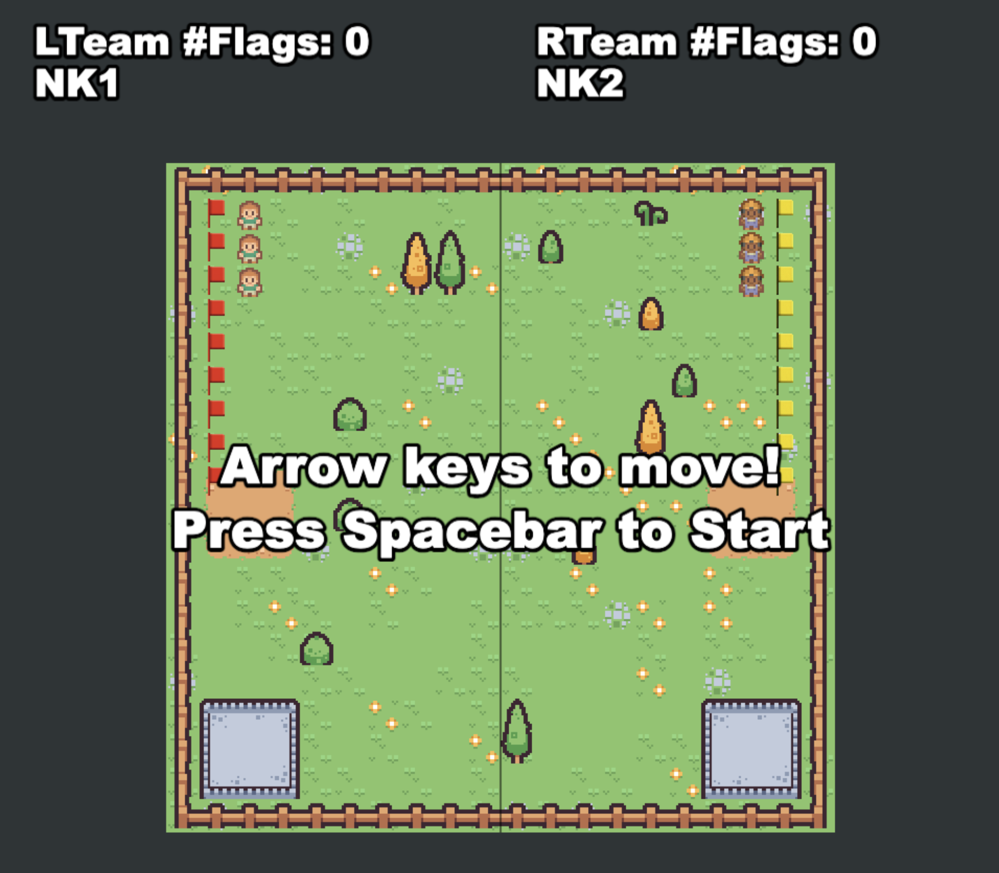

# Capture the Flag (夺旗游戏)

一个基于 Python 和 WebSocket 的多人夺旗游戏项目，支持 AI 智能体控制和强化学习训练。

## 📖 项目简介

Capture the Flag 是一个经典的团队竞技游戏。两个队伍（L 队和 R 队）在矩形地图上竞争，目标是从对方领地收集旗子并带回己方目标区域。玩家可以在己方领地内标记敌方玩家，被标记的玩家会被关进监狱，需要队友救援才能逃脱。

### 核心架构概念

**`World` 是所有状态的集合，`Player` 是自驱动的，根据 `World` 规划下一步的 `Action`，通过 `Action` 影响 `World` 的状态！**

这是一个循环的状态更新机制：
- **World** (当前状态) → **Player.plan()** (自驱动决策) → **Action** (执行) → **World** (新状态)

**关键特性**：
- `Player` 是**自驱动的**：主动观察 `World` 状态并做出决策
- `Action` 是**影响机制**：通过执行 `Action` 来改变 `World` 的状态
- `World` 是**状态容器**：维护所有游戏状态，响应 `Action` 的修改

### 核心特性

- 🎮 **实时多人游戏**：基于 WebSocket 的实时通信
- 🤖 **AI 智能体控制**：支持规则驱动和强化学习两种 AI 策略
- 🗺️ **动态地图系统**：支持障碍物、随机旗子位置等
- 📊 **可视化训练**：提供训练过程可视化和数据分析工具
- 🔧 **易于扩展**：清晰的代码结构，方便添加新策略

## 🎯 游戏规则

- 两个队伍：**L 队**（左侧）和 **R 队**（右侧）
- 每个队伍有自己的**领地**、**目标区域**、**监狱**和**旗子**
- **目标**：收集对方队伍的旗子并带回己方目标区域得分
- **标记机制**：在己方领地内可以标记敌方玩家，被标记的玩家会被关进监狱
- **救援机制**：队友可以前往监狱救援被关押的玩家
- **限制**：玩家只能拾取对方队伍的旗子，不能移动己方旗子



## 🚀 快速开始

### 环境要求

- **Python 3.10+**
- 推荐使用虚拟环境（.venv）
- 现代浏览器（支持 WebSocket）

### 项目依赖

项目依赖列表（`backend/requirements.txt`）：

- `torch>=2.0.0` - PyTorch 深度学习框架（用于强化学习训练）
- `numpy>=1.20.0` - 数值计算库
- `matplotlib>=3.5.0` - 数据可视化库
- `websockets>=10.0` - WebSocket 通信支持
- `ipython>=8.0.0` - IPython 支持（可选，用于 Jupyter notebook）

### 安装步骤

#### 1. 克隆项目

```bash
git clone <repository-url>
cd CTF-AI
```

#### 2. 创建虚拟环境

```bash
# 创建虚拟环境
python3 -m venv .venv
```

#### 3. 激活虚拟环境

**macOS/Linux:**
```bash
source .venv/bin/activate
```

**Windows:**
```bash
.venv\Scripts\activate
```

激活成功后，命令行提示符前会显示 `(.venv)` 标识。

#### 4. 安装依赖

```bash
cd backend
pip install -r requirements.txt
```

**注意**：如果系统提示 "externally-managed-environment" 错误（macOS 常见），可以使用以下方式之一：

**方式 1：使用虚拟环境（推荐）**
```bash
# 确保已激活虚拟环境
source .venv/bin/activate  # macOS/Linux
# 或
.venv\Scripts\activate     # Windows

# 然后在虚拟环境中安装
pip install -r requirements.txt
```

**方式 2：使用系统包管理器标志**
```bash
pip install --break-system-packages -r requirements.txt
```

如果需要安装训练相关的依赖（PyTorch 等），可以运行：

```bash
./install_dependencies.sh
```

#### 5. 验证安装

```bash
python3 -c "import torch; print(f'✓ PyTorch {torch.__version__}')"
python3 -c "import numpy; print(f'✓ NumPy {numpy.__version__}')"
python3 -c "import matplotlib; print(f'✓ Matplotlib {matplotlib.__version__}')"
python3 -c "import websockets; print(f'✓ WebSockets {websockets.__version__}')"
```

**注意**：IPython 是可选的，如果未安装也不会影响服务器运行（代码已处理兼容性）。

### 启动游戏

#### 1. 安装前端依赖

```bash
cd frontend
pnpm install
```

**注意**：如果还没有安装 pnpm，可以使用 `npm install -g pnpm` 安装。

#### 2. 启动前端开发服务器

```bash
cd frontend
pnpm dev
```

前端服务器会在 `http://localhost:8000` 启动（Vite 默认端口）。

#### 3. 启动后端服务器（L 队）

```bash
cd backend
python3 server.py 34712
```

#### 4. 启动后端服务器（R 队）

```bash
cd backend
python3 server.py 34713
```

#### 5. 访问游戏

在浏览器中打开：`http://localhost:8000`

### 配置说明

前端服务器通过 `frontend/game_config.json` 配置文件连接后端服务器：

```json
{
  "teams": [
    { "name": "L", "who": "user48-1"},
    { "name": "R", "who": "user48-2"}
  ],
  "setup": {
    "numPlayers": 9,
    "numFlags": 20,
    "useRandomFlags": true,
    "mapWidth": 20,
    "mapHeight": 20
  },
  "servers": {
    "user48-1": "ws://0.0.0.0:34712",
    "user48-2": "ws://0.0.0.0:34713"
  }
}
```

- `teams` 字段指定每个队伍对应的服务器ID
- `setup` 字段配置游戏设置，重启服务器后生效（注：有关地图长宽的暂时不可用）
- `servers` 字段配置每个服务器ID对应的 WebSocket URL
- 确保后端端口与配置中的端口一致

## 💻 开发指南

### 项目结构

```
CTF-AI/
├── backend/              # 后端服务器（AI 逻辑）
│   ├── server.py        # 主服务器文件（AI 实现）
│   ├── lib/             # 游戏引擎库（模块化设计）
│   │   ├── game_engine.py   # 统一入口，导出所有模块
│   │   ├── models.py        # 基础数据模型（Team, Player, Flag等）
│   │   ├── algorithms/      # 通用算法模块（BFS, A*, Dijkstra）
│   │   ├── pathfinding_service/  # 寻路服务和策略
│   │   ├── map.py           # 地图管理（GameMap）
│   │   ├── game.py          # 游戏逻辑（World）
│   │   ├── server.py        # WebSocket服务器
│   │   ├── RL.py            # 强化学习模块（DQN）
│   │   ├── data_structures.py  # 数据结构验证和规范化
│   │   └── constants.py      # 常量定义
│   ├── training/        # 训练相关脚本
│   │   ├── train_gym.py      # 训练脚本（基于Gymnasium）
│   │   └── visualize_training.py  # 训练可视化
│   ├── teleop.py       # 手动控制脚本
│   └── requirements.txt
├── frontend/            # 现代化前端（Vue 3 + TypeScript + Vite + Phaser 3）
│   ├── src/            # TypeScript 源代码
│   │   ├── game/       # 游戏核心代码
│   │   │   ├── managers/  # 管理器模块（InputManager, SocketManager等）
│   │   │   ├── objects/   # 游戏对象（Player, Flag）
│   │   │   └── scenes/    # Phaser 场景（Boot, Preloader, Game, GameOver）
│   │   └── components/  # Vue 组件
│   └── public/         # 静态资源
│       ├── game_config.json  # 游戏配置
│       └── assets/     # 游戏资源（图片、地图等）
└── README.md           # 本文件
```

### 代码架构说明

项目采用模块化、面向对象的设计：

- **`data_models/`**: 定义核心数据模型（Team, PlayerState, Position, Player, Flag, TargetArea, PrisonArea）
- **`algorithms/`**: 通用算法模块，提供可复用的寻路算法（BFS, A*, Dijkstra）
- **`pathfinding_service/`**: 寻路服务和策略，支持安全寻路（避开敌方影响区域）和权重寻路
  - 所有路径查找器（`PathFindingService`、`WeightedPathFinder`、`CorePathFinder`）现在只接收 `world` 对象
  - 玩家通过 `world.players` 访问，不再传递单独的 `players` 字典
  - 简化了 API，确保对游戏状态的一致访问
- **`map_service/`**: 管理地图物理结构（障碍物、目标区域、监狱等）
- **`game_service/`**: 实现游戏逻辑和规则（标记、救援、拾旗、得分等）
- **`utils/`**: 工具函数模块，包含玩家/旗帜查询、规则检查、距离计算等

#### 数据结构规范

所有玩家和旗帜数据统一使用标准键名：
- **玩家字典**：`name`, `posX`, `posY`, `team`, `hasFlag`, `inPrison`
- **旗帜字典**：`posX`, `posY`, `team`, `canPickup`, `pickedUp`

### 修改后端 AI

后端 AI 的核心逻辑在 `backend/server.py` 文件中。主要需要实现三个函数：

1. **`start_game(req)`** - 游戏初始化（游戏开始时调用一次）
2. **`plan_next_actions(req)`** - 决策函数（每个游戏 tick 调用，返回玩家动作）
3. **`game_over(req)`** - 游戏结束（游戏结束时调用一次）

**详细 API 文档和代码示例请参考 [AGENTS.md](AGENTS.md)**

### 强化学习训练

项目支持使用 DQN（Deep Q-Network）进行强化学习训练。

#### 快速开始

**⚠️ 重要：训练前必须先激活虚拟环境！**

```bash
# 1. 激活虚拟环境
cd backend
source .venv/bin/activate  # Linux/Mac
# 或
.venv\Scripts\activate  # Windows

# 2. 在线训练（连接游戏服务器）
python3 -m lib.reinforcement_learning.training.train_gym 8080 --algorithm CustomDQN

# 3. 离线训练（不连接服务器）
python3 -m lib.reinforcement_learning.training.train_gym 8080 --algorithm CustomDQN --train-offline
```

#### 训练脚本说明

- **`train_gym.py`**: 训练脚本（基于Gymnasium标准接口）
  - 支持在线训练（连接游戏服务器）和离线训练（模拟环境）
  - 支持多种算法：DQN, PPO, A2C, CustomDQN
  - 完全基于Gymnasium标准，可使用stable-baselines3等工具

#### 训练可视化

使用可视化脚本实时查看训练进度：

```bash
cd backend
python3 training/visualize_training.py /tmp/ctf-ai/training_stats.json 5
```

可视化内容包括：
- Episode奖励趋势
- 训练损失趋势
- 胜率趋势
- 统计信息面板（包含训练建议）

#### 训练建议

- **可以停止训练**：胜率 ≥ 80%，或胜率 ≥ 60% 且稳定，或奖励收敛且损失稳定
- **需要继续训练**：胜率 < 50%，奖励波动大（标准差 > 50），损失 > 1.0

### 修改前端

前端使用 **Vue 3.5 + TypeScript + Vite + Phaser 3** 开发，采用模块化、面向对象的设计：

```
frontend/
├── src/
│   ├── game/          # 游戏核心代码
│   │   ├── managers/  # 管理器模块
│   │   │   ├── GameStateManager.ts  # 游戏状态管理（单例+Registry）
│   │   │   ├── SocketManager.ts     # WebSocket 通信（单例+EventEmitter）
│   │   │   ├── InputManager.ts      # 输入管理（观察者+策略模式）
│   │   │   ├── MapManager.ts        # 地图管理
│   │   │   ├── PhysicsManager.ts    # 物理系统管理
│   │   │   └── UIManager.ts         # UI 管理
│   │   ├── objects/   # 游戏对象
│   │   │   ├── Player.ts  # 玩家对象
│   │   │   └── Flag.ts    # 旗子对象
│   │   └── scenes/    # Phaser 场景
│   │       ├── Boot.ts      # 启动场景
│   │       ├── Preloader.ts # 预加载场景
│   │       ├── Game.ts      # 主游戏场景
│   │       └── GameOver.ts  # 游戏结束场景
│   └── components/    # Vue 组件
│       └── GameContainer.tsx  # 游戏容器组件
├── public/
│   ├── game_config.json    # 游戏配置（服务器连接等）
│   └── assets/        # 游戏资源（图片、地图等）
└── package.json       # 依赖配置
```

**技术栈**：
- Vue 3.5 - 渐进式 JavaScript 框架
- TypeScript - 类型安全的 JavaScript 超集
- Vite - 下一代前端构建工具
- Phaser 3.85+ - HTML5 游戏框架

**开发命令**：
```bash
cd frontend
pnpm install         # 安装依赖
pnpm dev             # 开发模式
pnpm build           # 构建生产版本
pnpm test            # 运行单元测试（Vitest）
pnpm test:ui         # 运行单元测试（UI模式）
pnpm test:e2e        # 运行E2E测试（Playwright）
pnpm test:e2e:ui     # 运行E2E测试（UI模式）
pnpm test:e2e:headed # 运行E2E测试（有头模式）
```

**前端优化**：
- 移动同步优化：前端玩家执行完一个动作后，等待后端下一个指令再继续移动
- 预判逻辑：如果路径中下一步和再下一步方向相同，玩家可以连续移动，减少停顿
- 路径可视化：前端显示后端计算的路径，便于调试和观察AI行为
- 详细日志：前端记录详细的路径信息（起点、当前、下一步、终点）和耗时数据

#### 修改游戏配置

编辑 `frontend/game_config.json`：

- **修改队伍配置**:
```json
{
  "teams": [
    { "name": "L", "who": "user48-1"},
    { "name": "R", "who": "user48-2"}
  ]
}
```

- **修改服务器连接**:
```json
{
  "servers": {
    "user48-1": "ws://0.0.0.0:34712",
    "user48-2": "ws://0.0.0.0:34713"
  }
}
```

- **修改游戏设置**:
```json
{
  "setup": {
    "numPlayers": 3,      // 每队玩家数量
    "numFlags": 9,        // 每队旗子数量
    "useRandomFlags": true // 是否随机生成旗子位置
  }
}
```

#### 调试前端

- 打开浏览器开发者工具（F12 或 Cmd+Option+I）
- 查看 Console 标签页查看日志
- 查看 Network 标签页检查 WebSocket 连接
- 确保禁用缓存（Disable cache）以加载最新代码

## 🎮 手动控制

项目提供了手动控制脚本 `backend/teleop.py`，允许通过键盘控制玩家：

```bash
cd backend
python3 teleop.py <端口号>
```

控制键位：
- **L0**: `j`(左) `i`(上) `k`(下) `l`(右)
- **L1**: `t`(左) `f`(上) `g`(下) `h`(右)
- **L2**: `w`(上) `s`(下) `a`(左) `d`(右) 或方向键

按 `q` 退出手动控制。

## 🧪 测试

项目包含完整的测试套件：

### 后端测试

```bash
cd backend
python3 -m pytest tests/ -v
```

测试覆盖：
- 玩家动作测试（标记、救援、拾旗、得分）
- 路径规划稳定性测试
- 游戏状态更新测试

### 前端测试

**单元测试（Vitest）**：
```bash
cd frontend
pnpm test              # 运行所有单元测试
pnpm test:ui           # 运行测试（UI模式）
pnpm test:coverage     # 生成测试覆盖率报告
```

**E2E测试（Playwright）**：
```bash
cd frontend
pnpm test:e2e          # 运行E2E测试（Chromium）
pnpm test:e2e:ui       # 运行E2E测试（UI模式）
pnpm test:e2e:headed   # 运行E2E测试（有头模式，可见浏览器）
```

测试覆盖：
- 游戏场景初始化测试
- 玩家移动和路径规划测试
- 游戏循环测试（抢旗并返回）
- 策略测试（进攻路线、防守路线）

## ❓ 常见问题与故障排除

### 1. 模块导入错误

**问题**：`ModuleNotFoundError: No module named 'xxx'`

**解决方案**：
- 确保已激活虚拟环境
- 检查是否已安装所有依赖：`pip install -r requirements.txt`
- 验证 Python 解释器路径是否正确

### 2. IPython 导入错误

**问题**：`ModuleNotFoundError: No module named 'IPython'`

**解决方案**：
- IPython 是可选的，代码已处理兼容性
- 如需安装：`pip install ipython`
- 如果仍报错，检查 `backend/lib/game_engine.py` 中的导入逻辑

### 3. WebSocket 连接失败

**问题**：前端无法连接到后端服务器

**解决方案**：
- 检查后端服务器是否已启动
- 确认端口号与 `frontend/game_config.json` 中的配置一致
- 检查防火墙设置
- 确保 WebSocket URL 格式正确：`ws://localhost:端口号`

### 4. 缩进错误

**问题**：`IndentationError: expected an indented block`

**解决方案**：
- 确保使用一致的缩进（推荐使用 4 个空格）
- 检查 `if/else/for` 语句后的代码块是否正确缩进
- 使用代码格式化工具（如 `black` 或 `autopep8`）

### 5. 端口被占用

**问题**：`Address already in use`

**解决方案**：
- 查找占用端口的进程：`lsof -i :端口号`（macOS/Linux）或 `netstat -ano | findstr :端口号`（Windows）
- 终止占用进程或使用其他端口
- 修改 `frontend/game_config.json` 中的端口配置

### 6. 虚拟环境相关问题

**问题**：在虚拟环境中安装包后仍无法导入

**解决方案**：
- 确认已激活虚拟环境（命令行前应显示 `(.venv)`）
- 检查 IDE 是否配置使用项目虚拟环境
- 重新创建虚拟环境：`rm -rf .venv && python3 -m venv .venv`

## 📄 许可证

查看 [LICENSE](LICENSE) 文件了解详情。

## 🤝 贡献

欢迎提交 Issue 和 Pull Request！

## 📚 相关文档

- [AGENTS.md](AGENTS.md) - AI 智能体开发指南（详细 API 文档和代码示例）
- [backend/lib/reinforcement_learning/README.md](backend/lib/reinforcement_learning/README.md) - 强化学习训练文档

